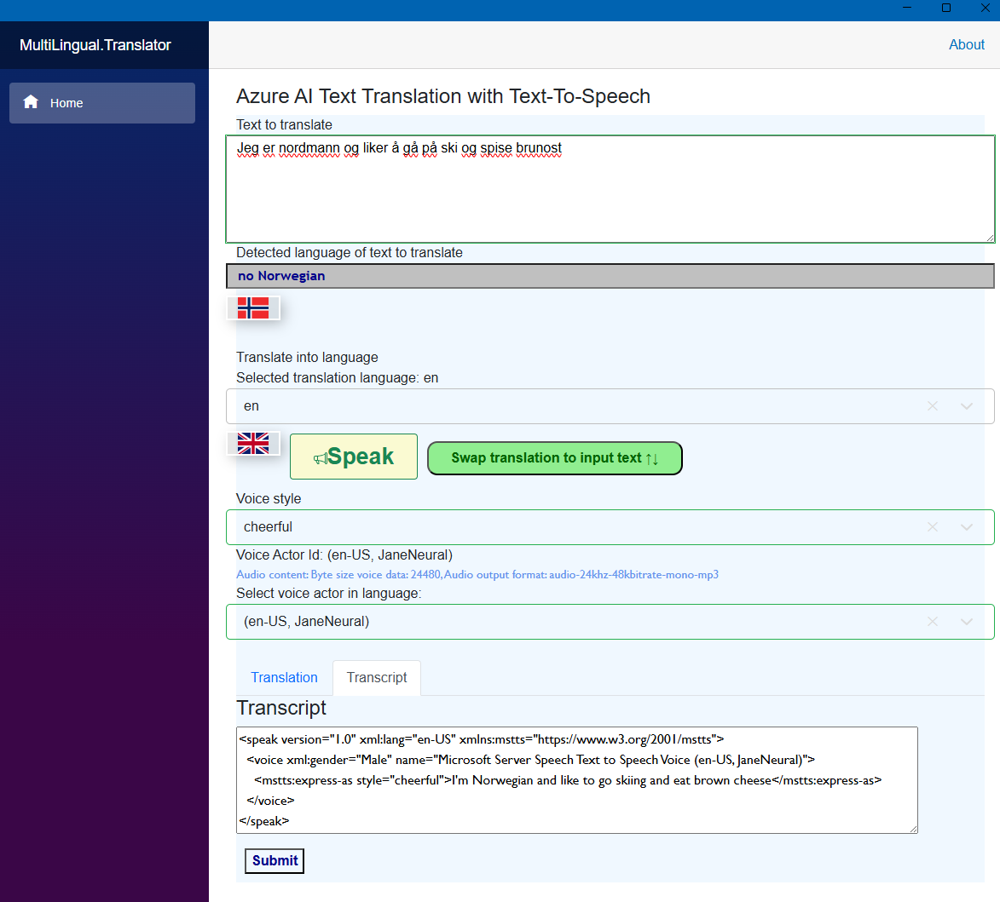

# MultiLingual.Translator
This repo contains a .NET MAUI Blazor app written with C# and .NET 8.

It allows the end user to enter some text to translate into another supported language in 
Azure AI services (formally known as Azure Cognitive services). 

Also, it is possible to do speech synthesis. That is, to listen to the translated text in 
a neural net trained actor in the selected language and even choose voice styles,
if it is supported.

A technical article has been written and is available here:
https://toreaurstad.blogspot.com/2024/05/azure-cognitive-synthesized-text-to.html

A screenshot showing the app running is shown below:

